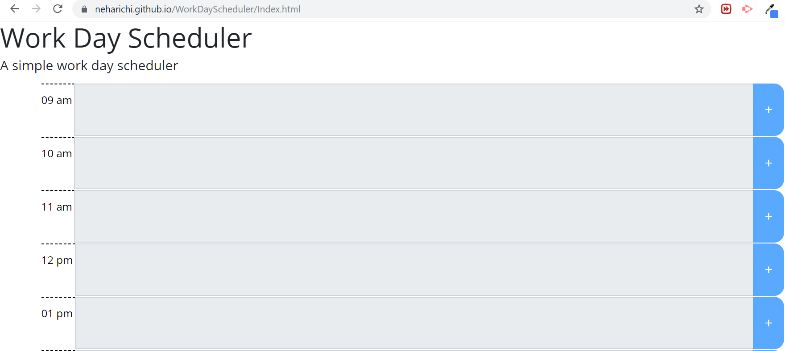

# WorkDayScheduler
This is a simple scheduling application that allows user to save their activities. 

## Installation: ##

    You can check the running project: https://neharichi.github.io/WorkDayScheduler/Index.html

## Usage: ##
  - When this website is opened, users gets a default view of calender from 9am to 5pm. For every hour there is one row where user can add/edit/delete there scheduling activities.
   
  - How to Save Activities.
    - User can click on the + sign at the end of each row. Clicking on this button stores the time and user input in localStorage. 
    Each hour is color coded to reflect time slots 
     - gray represents Past, 
     - red represents Present
     - green represent Future. 
    
    This changes depending on the time of the day. past time activities won;t be editable. You can only edit present and future entries.

     
     
   

   